# Pre-requisitos {-}

A continuación se presentarán los pasos necesarios para descargar e instalar los softwares [R](https://cran.r-project.org/) y [RStudio](https://posit.co/products/open-source/rstudio/) en Windows y macOS, además de los paquetes de R que se utilizan en el libro. Para estos pasos requiere de una computadora personal, ya sea laptop o de escritorio, donde instalar los softwares y de una conexión a internet estable durante el proceso de descarga e instalación. En el caso de que tuviera instalado R o RStudio, se recomienda verificar que posea la última versión de estos softwares a la fecha `r Sys.Date()` (R 4.2.3 y RStudio Desktop 2023.03.0+386). En todo caso, se recomienda bastante seguir los siguientes pasos para actualizar las versiones.

## Instalación de R en Windows {-}

Para instalar R en Windows:

1. Ir a la web [CRAN](https://cran.r-project.org/).
2. Dar click en [Download R for Windows](https://cran.r-project.org/bin/windows/).

```{r windows, echo=FALSE, out.width = '80%', fig.align="center", fig.cap="Descargar R para Windows"}
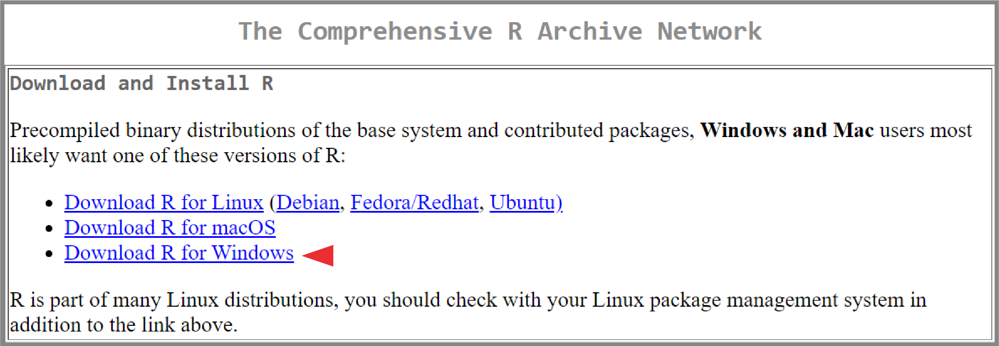
```

3. Dar click en [base](https://cran.r-project.org/bin/windows/base/) o [install R for the first time](https://cran.r-project.org/bin/windows/base/).


```{r base, echo=FALSE, out.width = '80%', fig.align="center", fig.cap="Instalar R por primera vez"}
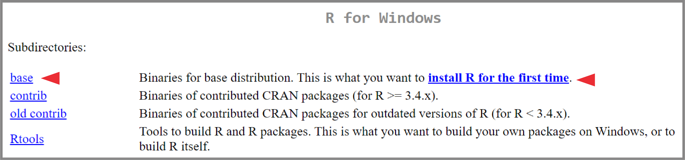
```

4. Dar click en [Download R-4.2.3 for Windows](https://cran.r-project.org/bin/windows/base/R-4.2.3-win.exe) para descargar el archivo ejecutable llamado **R-4.2.3-win.exe**.

```{r windows-download, echo=FALSE, out.width = '80%', fig.align="center", fig.cap="Descargar instalador de R para Windows"}
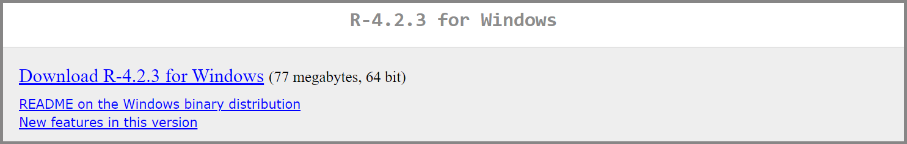
```

5. Ejecutar el archivo **R-4.2.3-win.exe**. En caso Windows preguntara si deseamos que la aplicación haga cambios en el sistema, respondemos que "Sí".

6. Elegir el idioma para la instalación.

```{r language, echo=FALSE, out.width = '30%', fig.align="center", fig.cap="Elegir el lenguaje de instalación"}
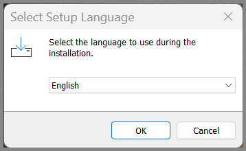
```

7. Revisar la licencia de uso y dar click en Next.

```{r license, echo=FALSE, out.width = '50%', fig.align="center", fig.cap="R está bajo la Licencia Pública General GNU"}
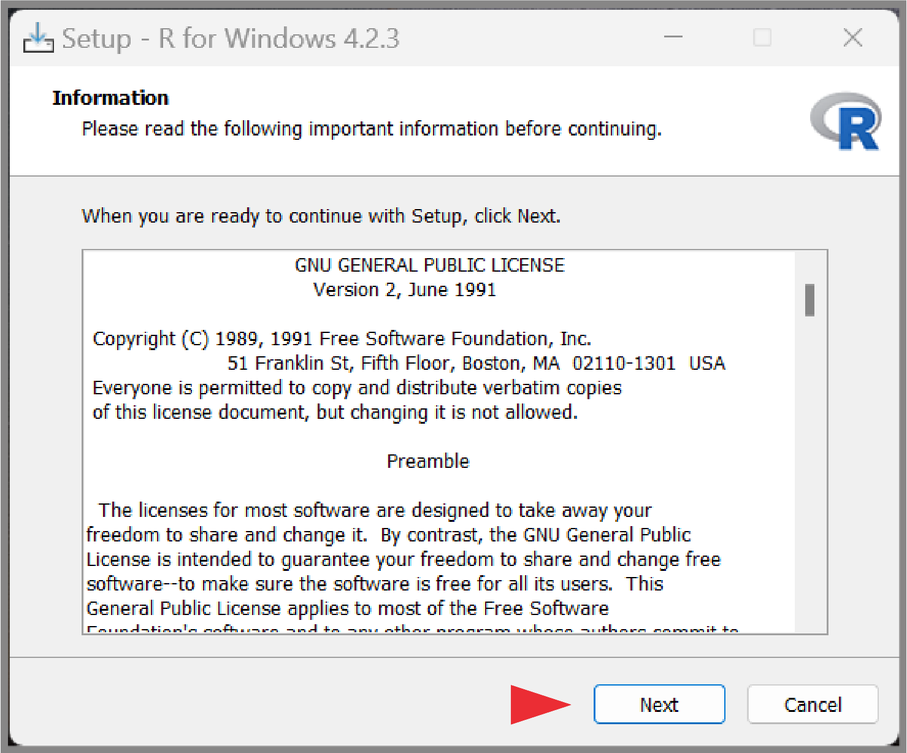
```

8. Para una instalación por defecto, solo dar **Next** a todos los pasos hasta que el instalador nos diga que la instalación ha finalizado.

9. Para verificar que la instalación ha sido correcta, buscar en su escritorio el acceso directo con nombre **R 4.2.3** o usar el buscador de Windows para encontrar el programa con el mismo nombre. Al ejecutarlo se debería abrir la Interfaz Gráfica de Usuario de R (RGui, por sus siglas en Inglés) mostrando la siguiente interfaz:

```{r rgui, echo=FALSE, out.width = '80%', fig.align="center", fig.cap="RGui"}
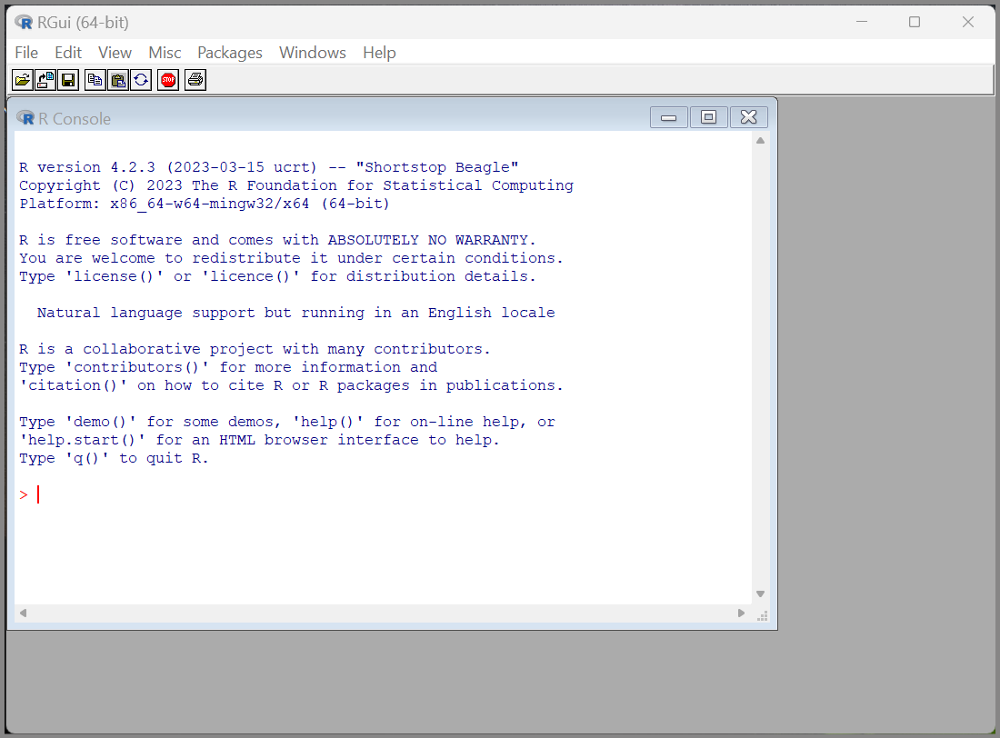
```

## Instalación de R en macOS {-}

Para instalar R en macOS:

1. Ir a la web [CRAN](https://cran.r-project.org/).
2. Dar click en [Download R for macOS](https://cran.r-project.org/bin/macosx/).

```{r macos, echo=FALSE, out.width = '80%', fig.align="center", fig.cap="Descargar R para macOS"}
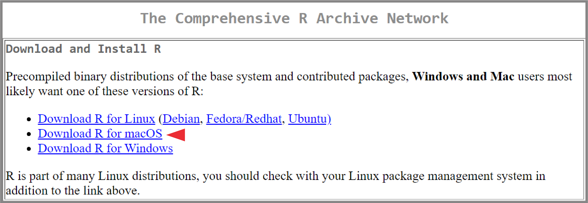
```

3. Para la versión macOS 11 (Big Sur) y mayores y procesador Apple silicon con arquitectura arm64 dar click en [R-4.2.3-arm64.pkg](https://cran.r-project.org/bin/macosx/big-sur-arm64/base/R-4.2.3-arm64.pkg). Debería descargarse un archivo ejecutable con el mismo nombre.

```{r macos-bigsur, echo=FALSE, out.width = '80%', fig.align="center", fig.cap="R para Big Sur o mayor y procesador Apple silicon"}
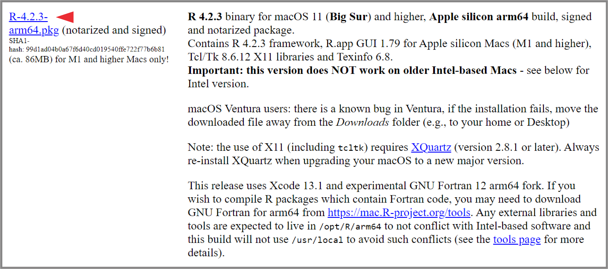
```

Para la versión macOS 10.13 (High Sierra) y mayores y procesador Intel con arquitectura 64-bit dar click en [R-4.2.3.pkg](https://cran.r-project.org/bin/macosx/base/R-4.2.3.pkg). Debería descargarse un archivo ejecutable con el mismo nombre.

```{r macos-highsierra, echo=FALSE, out.width = '80%', fig.align="center", fig.cap="R para High Sierra o mayor y procesador Intel"}
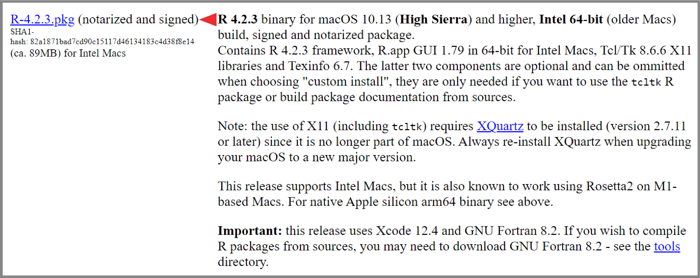
```

Leer muy bien las especificaciones de cada versión de R.

4. Una vez descargado, ejecutar el archivo **.pkg** correspondiente y seguir las instrucciones de instalación. Para una instalación por default aceptar todas las configuraciones predeterminadas.

5. Para verificar que la instalación es correcta, buscar en su escritorio el acceso directo con nombre **R 4.2.3** o usar el buscador de macOS (Finder) para encontrar el programa con el mismo nombre. Al ejecutarlo se debería abrir el RGui con una vista similar a la Figura \@ref(fig:rgui).

## Instalación de RStudio {-}

RStudio es un Entorno de Desarrollo Integrado (IDE por sus siglas en Inglés) para R. Para instalar la versión de escritorio de RStudio seguir los siguientes pasos:

1. Asegurarse de tener primero instalado R siguiendo los pasos de las secciones anteriores.
1. Ingresar a la web de descarga de [RStudio Desktop](https://posit.co/download/rstudio-desktop/).
2. Dar click en [Donwload RStudio Desktop for Windows](https://download1.rstudio.org/electron/windows/RStudio-2023.03.0-386.exe) o [Donwload RStudio Desktop for macOS](https://download1.rstudio.org/electron/macos/RStudio-2023.03.0-386.dmg) dependiendo de su sistema operativo. Se descargará el archivo ejectuable con nombre **RSTUDIO-2023.03.0-386** con extensión **.exe** si se encuentra en Windows o **.dmg** si está en macOS. Por ejemplo, para Windows:

```{r rstudio, echo=FALSE, out.width = '80%', fig.align="center", fig.cap="Descargar RStudio para Windows o macOS"}
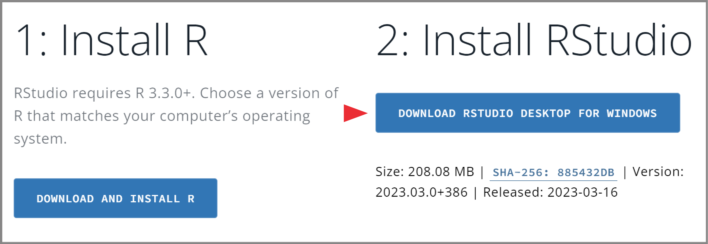
```

3. Una vez descargado, ejecutar el instalador y seguir las instrucciones de instalación. Para una instalación por default aceptar todas las configuraciones predeterminadas.

4. Para verificar que la instalación ha sido correcta, buscar en su escritorio el acceso directo con nombre **RStudio** o usar el buscador de su sistema operativo para encontrar el programa con el mismo nombre. Al ejecutarlo se debería abrir el programa con la siguiente interfaz (ejemplo plara Windows):

```{r rstudio-vista, echo=FALSE, out.width = '80%', fig.align="center", fig.cap="Interfaz gráfica de RStudio Desktop"}
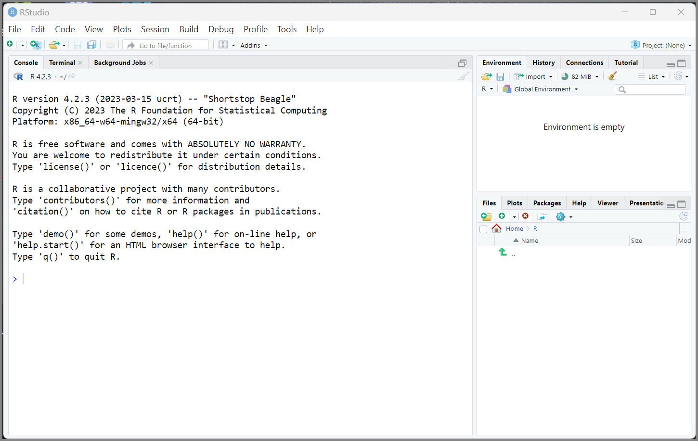
```

Una vez instalados R y RStudio, es suficiente con usar RStudio para trabajar con R. Es decir, no es necesario abrir otra interfaz como RGui, RStudio ya se tiene integrado R. En este libro se asume que toda la interacción con R se hace a través de RStudio.

Para más detalles sobre cómo configurar y personalizar RStudio ver la sección *Customizing the interface* del tutorial [Introducing RStudio and R Markdown](https://www.pipinghotdata.com/posts/2020-09-07-introducing-the-rstudio-ide-and-r-markdown/) de Shannon Pileggi.

## Instalación de paquetes de R {-}

Los paquetes son extensiones de R. Cada paquete es una colección de funcionalidades adicionales para realizar una tarea específica. Actualmente existe una cantidad inmensa de paquetes para realizar una infinidad de tareas, y muchos paquetes más están activamente en desarrollo. 

R viene pre-cargado con quince paquetes *base*. Es posible que también se hayan instalado un aproximado de quince paquetes recomendados, por lo que al abrir R por primera podríamos encontrar hasta treinta paquetes. La lista de estos paquetes está bajo el nombre **System Library** y se puede visualizar en la pestaña **Packages** del panel inferior derecho:

```{r packages, echo=FALSE, out.width = '80%', fig.align="center", fig.cap="Pestaña Packages"}
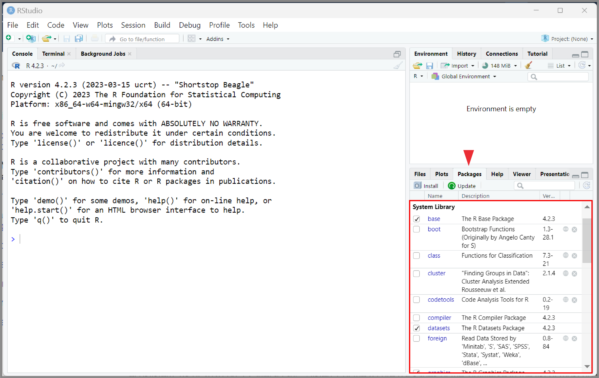
```

Ahora veremos las diferentes formas para instalar paquetes de R usando RStudio.

### Usando las herramientas de RStudio {-}

1. En el menú de RStudio, ir a **Tools > Install** Packages. Se debería abrir la siguiente ventana:

```{r install-packages, echo=FALSE, out.width = '30%', fig.align="center", fig.cap="Ventana de instalación de paquetes"}
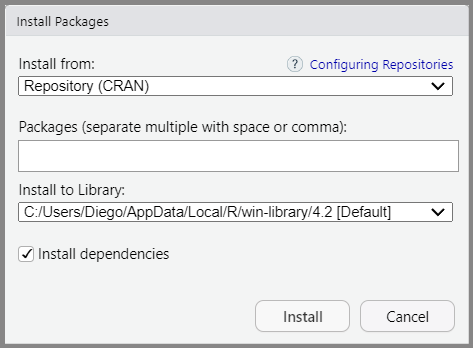
```

También podemos dar click en el botom **Install** de la pestaña **Packages** del panel inferior derecho:

```{r install-buttom, echo=FALSE, out.width = '80%', fig.align="center", fig.cap="Botón de instalación de paquetes"}
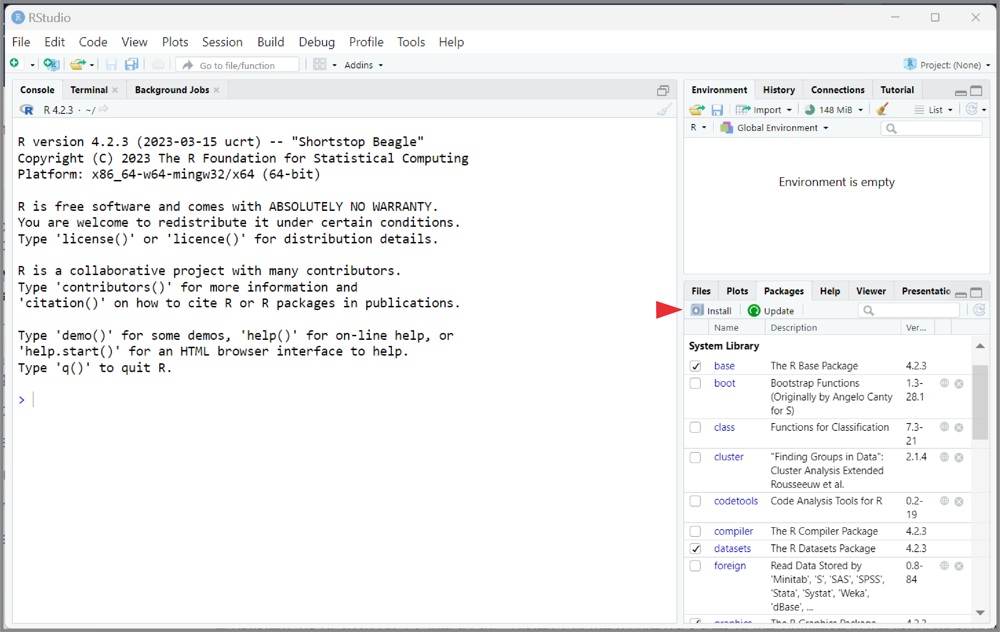
```

2. En la caja de **Packages**, escribir el nombre del paquete se quiere instalar. Por ejemplo, podemos escribir **tidyverse**, el cual es el paquete que más se usará en este libro:

```{r tidyverse, echo=FALSE, out.width = '30%', fig.align="center", fig.cap="Instalar tidyverse"}
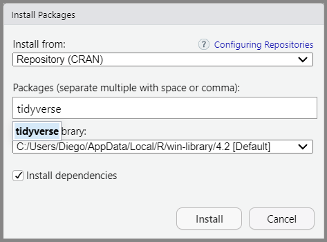
```

Si necesitamos instalar varios paquetes, escribimos los nombres separados por un espacio o por una coma.

No es necesario cambiar las otras configuraciones en esta ventana, a menos que se requiera hacer una instalación más avanzada.

3. Damos click en **Install** e iniciará la instalación. Es normal que aparezcan algunas ventanas de carga mientras se instalan los paquetes.

4. Para verificar que el paquete ha sido instalado, buscamos el nombre del paquete en la lista **System Library** de la pestaña **Packages** del panel inferior derecho así como en la Figura \@ref(fig:packages). Es posible que otros paquetes también hayan sido instalados. Estos paquetes son las dependencias del paquete que inicialmente queríamos instalar.

### Usando la consola {-}

1. Ubicar la pestaña llamada **Consola** que se encuentra en el panel izquierdo (o panel izquierdo inferior):

```{r console, echo=FALSE, out.width = '80%', fig.align="center", fig.cap="Consola de RStudio"}
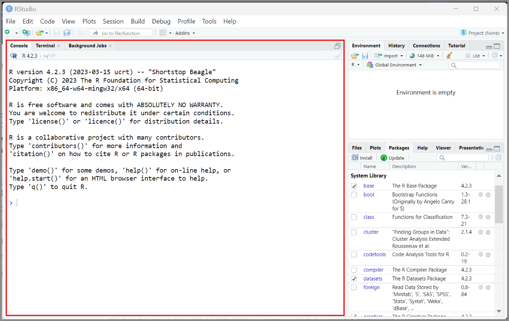
```

2. Ubicar el cursor (dar click) en el símbolo **>** y tipear el commando `install.packages("tidyverse")`:

```{r install-console, echo=FALSE, out.width = '80%', fig.align="center", fig.cap="Instalación mediante comando en la consola"}
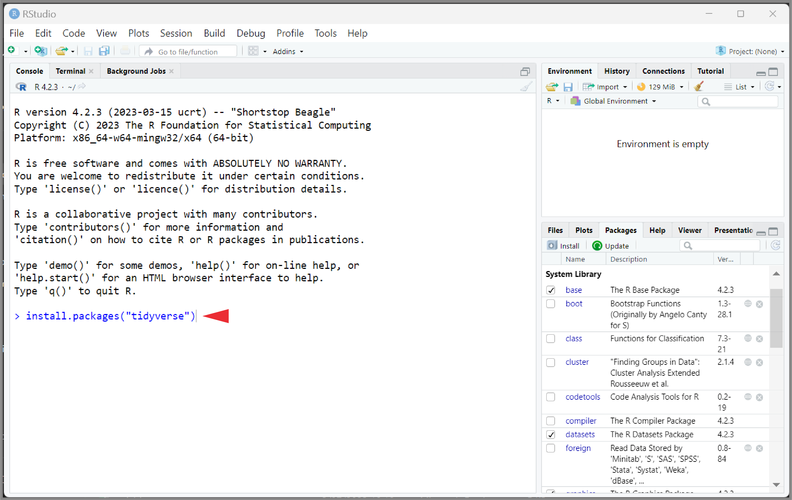
```

Para instalar más de un paquete, se pueden listar usando una estructura de concatenación. Por ejemplo, para installar los paquetes **haven**, **stringr** y **lubridate**, escribimos los nombres entre comillas y separados por comas dentro de la estructura de concatenación `c()`: `c("haven", "stringr", "lubridate")`. Esta lista luego la escribimos dentro de la función `install.packages()`, resultando en el siguiente comando: 

```{r eval=FALSE}
install.packages(c("haven", "stringr", "lubridate"))
```

Este último comando es el que se escribe en la consola para instalar todos los paquetes.

3. Asegurarse que el cursor está en la consola (parpadea) y presionar **Enter** en el teclado. La instalación iniciará.

4. Para verificar la instalación ha terminado, buscar el paquete en la lista de paquetes instalados.

### Instalar todos los paquetes del libro {-}

Los paquetes que se usan en el libro son los siguientes:

```{r eval=FALSE, echo=FALSE}
packages_raw = lapply(
  list.files(pattern = "-.+Rmd"), 
  function(x){
    d = readLines(x)
    d = d[grepl("library\\(.*\\)", d)]
    gsub("library\\((.*)\\)", "\\1", d)
  }
)

packages <- unique(unlist(packages_raw))
packages_list <- packages[ !packages %in% c("DT","patchwork", "pacman", "kableExtra")]

# write.csv(packages_list, "misc/list_pckg.csv", row.names = F)
```

```{r echo=FALSE, message=FALSE, warning=FALSE}
packages <- read.csv("list_pckg.csv", stringsAsFactors = F) |> unlist()
packages_sort <- sort(packages)

table <- split(packages_sort, cut(seq_along(packages_sort), 4, labels = FALSE)) 

table_df <- data.frame(lapply(table, `length<-`, max(lengths(table))))

row.names(table_df) <- NULL
```

```{r packages-table, echo=FALSE, message=FALSE, warning=FALSE}
options(knitr.kable.NA = '')
kableExtra::kable(
  table_df, col.names = NULL, caption = "Paquetes de R usados en el libro"
)
```

Para instalar todos los paquetes usados en el libro, copiar el siguiente comando en la consola y dar **Enter**:

```{r eval=F}
source("https://raw.githubusercontent.com/healthinnovation/upch_r101/main/r101_init.R")
```

Es posible que aparezca el siguiente mensaje al momento de la instalación: 

```{r source, echo=FALSE, fig.align="center", out.width = '60%', fig.cap="Mensaje de instalación"}
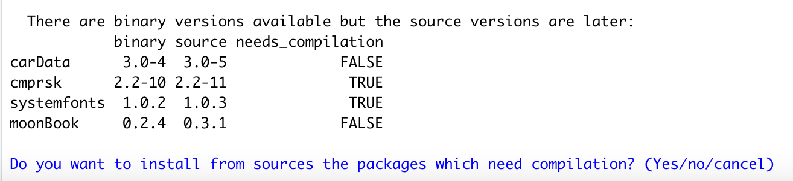
```

Escribir `Yes` en la consola para autorizar la instalación de las últimas versiones de los paquetes.

Por último, verifique que los paquetes en la Tabla \@ref(tab:packages-table) se hayan instalado correctamente en el panel inferior derecho, pestaña **Packages**.

```{r check, echo=FALSE, fig.align="center", out.width = '60%', fig.cap="Verificación de instalación"}
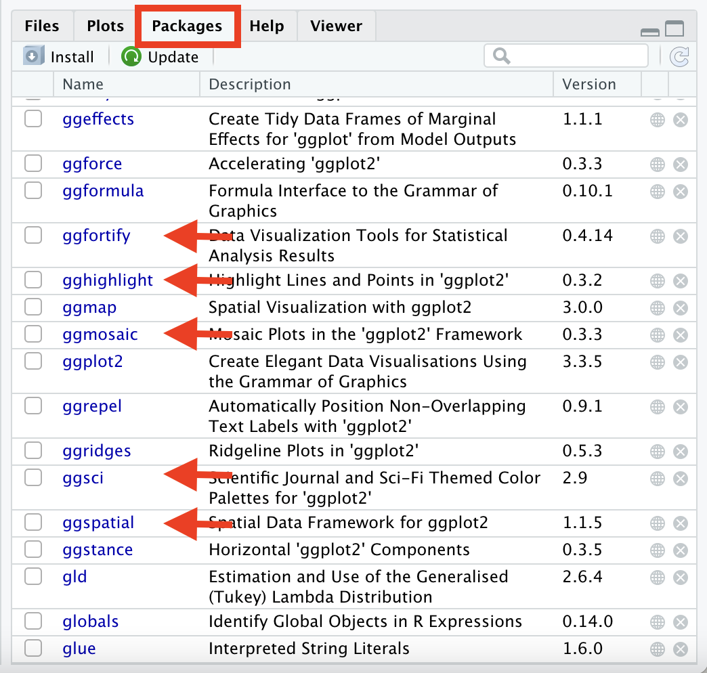
```

También se pueden instalar los paquetes manualmente siguiendo las instrucciones de la secciones [Usando las herramientas de RStudio] o [Usando la consola].

## Personalización de la apariencia de RStudio (Opcional) {-}

Si desea personalizar el entorno de RStudio, siga los siguientes pasos:

Para Windows:

Abra RStudio y vaya a la parte superior y cliquée en `Tools` y en el panel desglosable cliquée en `Global Options...`

```{r echo=FALSE, fig.align="center", out.width = '80%', fig.cap=""}
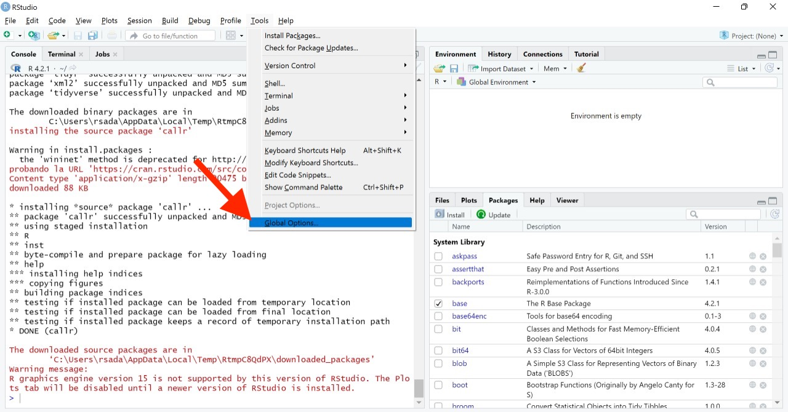
```

Para macOS:

Abre RStudio y al costado de la manzanita, cliquea en RStudio y en las opciones desglosables cliquea en `Preferencias...`.

```{r echo=FALSE, fig.align="center", out.width = '50%', fig.cap=""}
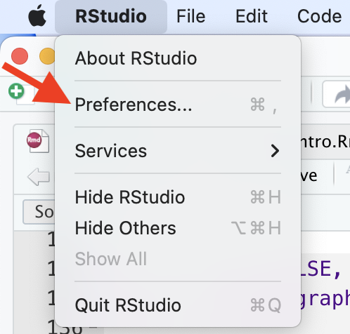
```

En ambos sistemas operativos, vaya a la sección de `Apariencia` y modifique el tema, enfoque, tamaño y tipo de letra, y finalmente el tema de su preferencia. Se recomienda un tema con fondo oscuro para evitar el cansancio de su vista. Finalmente, cliquée en `OK` para aplicar las modificaciones.

```{r echo=FALSE, fig.align="center", out.width = '70%', fig.cap=""}
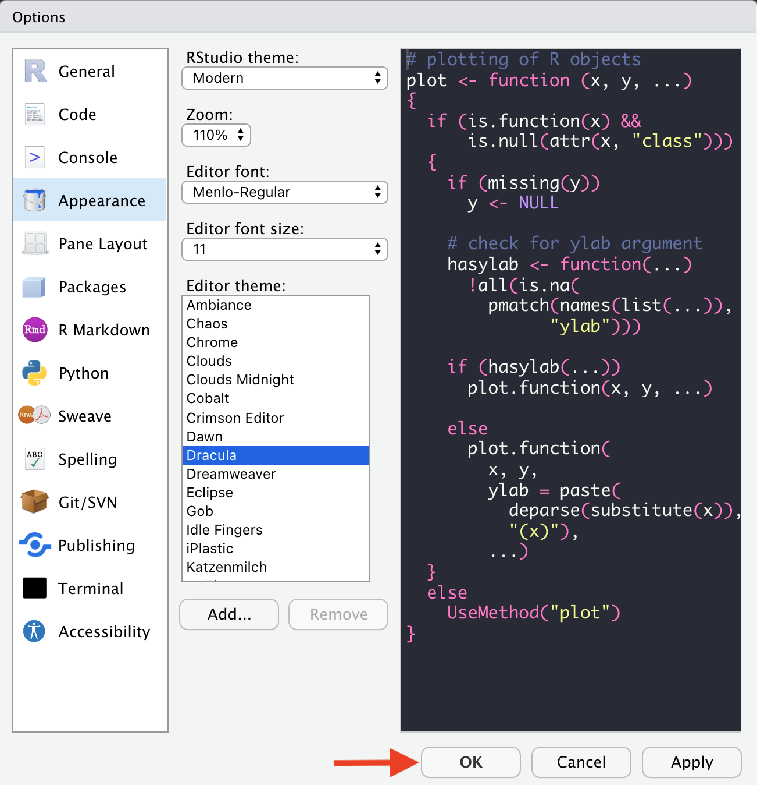
```

Si deseas que tus paréntesis tengan diferente colores, en la sección de `Código`, luego vaya a `Display` y selecciones `Rainbowl parentheses`.

```{r echo=FALSE, fig.align="center", out.width = '70%', fig.cap=""}
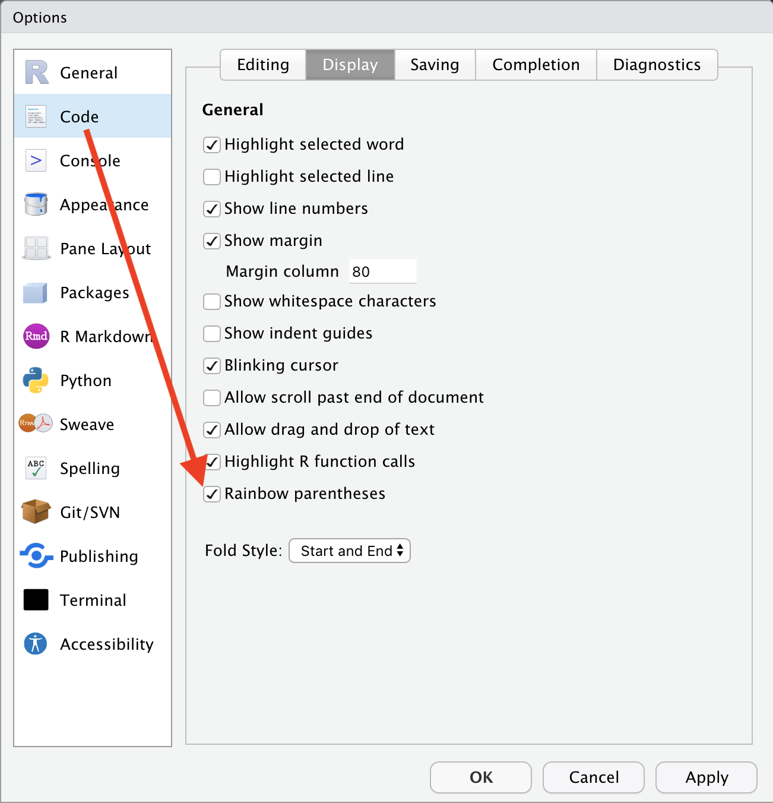
```

Si desea cambiar la posición de su `Recursos`, `consola`, `ambiente, historia, conecciones...` y/o `files, plots...` vaya a `Disposición de panel` y selecciones el orden de su preferencia.

```{r echo=FALSE, fig.align="center", out.width = '70%', fig.cap=""}
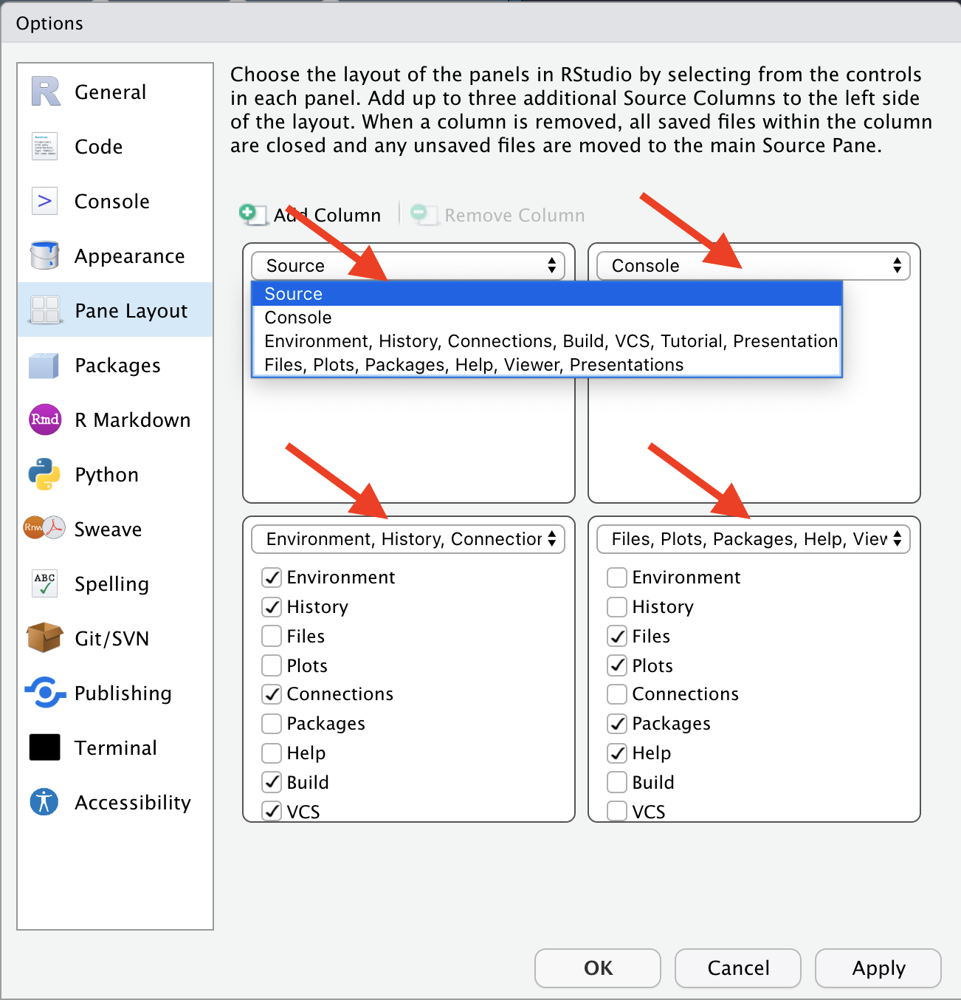
```

La apariencia del entorno de RStudio ya se encuentra modificada y lista para usar.

