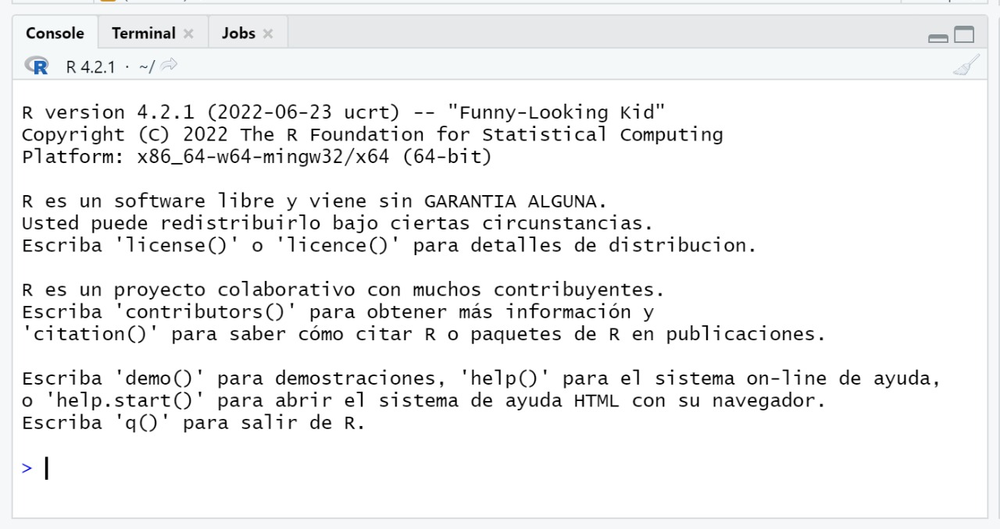
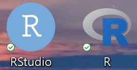
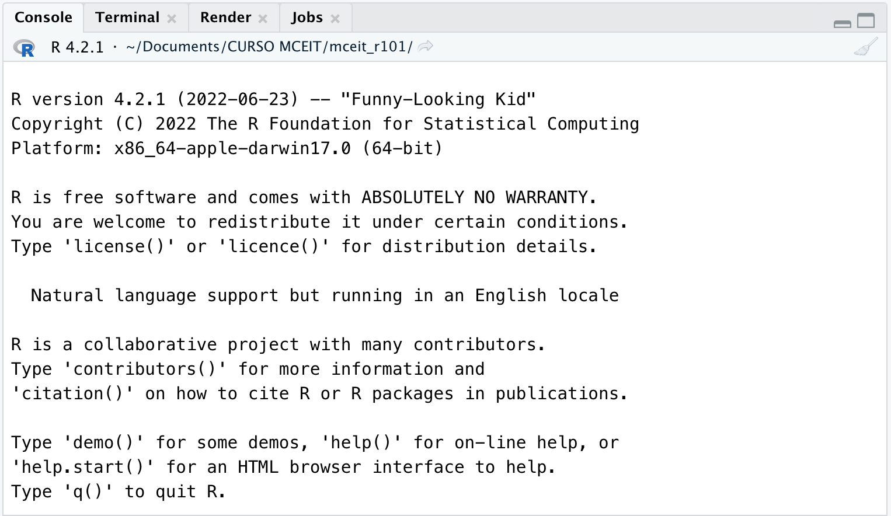
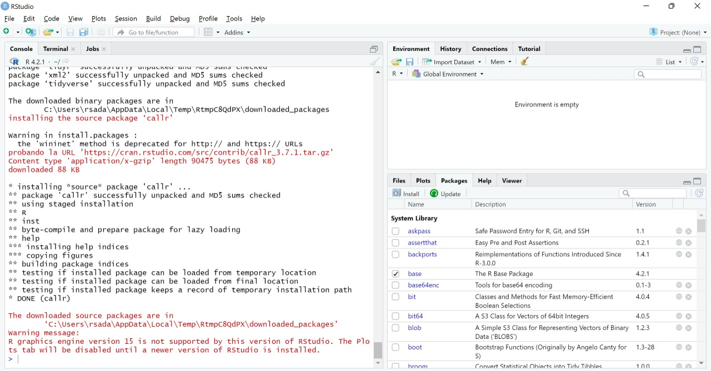
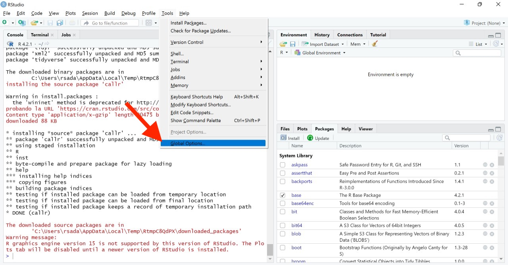
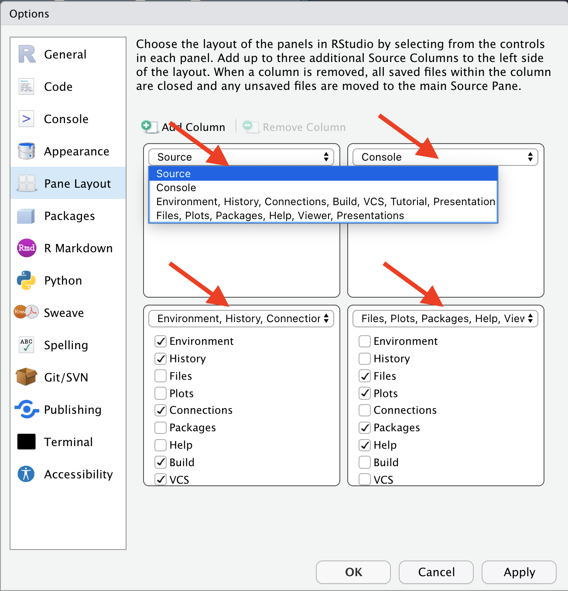

# Pre-requisitos {-}

A continuación se presentarán los pasos necesarios para instalar correctamente R y RStudio en Windows y macOS:

1. Descargar e Instalar R.
2. Descargar e instalar RStudio.
3. Descargar e instalar los paquetes que se utilizarán durante el curso.

Requiere de una laptop donde instalar los programas y de una conexión a internet estable durante el proceso de descarga e instalación.

Para el curso deberá tener instalados los siguientes programas:

  * [R](https://cran.r-project.org/)
  * [RStudio](https://rstudio.com/products/rstudio/)
  
Los siguientes detalles son tomados de [Riva Quiroga](https://twitter.com/rivaquiroga).

## 1. Instalar R {-}
Puedes descargar R desde https://cran.r-project.org/. Debes elegir la opción que corresponda, según tu sistema operativo.

```{r echo=FALSE, out.width = '100%', fig.align="center"}
knitr::include_graphics("figures/00-prereq/01-download-install-r.png")
```

Si utilizas Windows, te preguntará qué es lo que quieres instalar. Selecciona "base".

```{r echo=FALSE, out.width = '100%', fig.align="center"}
knitr::include_graphics("figures/00-prereq/02-r-for-windows.png")
```

En el caso de macOS, elige la primera opción que aparece bajo "Latest release", es decir, "R-4.1.2.pkg (notarized and signed)".

```{r echo=FALSE, out.width = '100%', fig.align="center"}
knitr::include_graphics("figures/00-prereq/03-r-for-mac.png")
```

Luego, sigue los pasos de instalación, tal como lo haces con cualquier programa.

Si todo sale bien, al abrir R en tu computador deberías ver algo parecido a esto en Windows y macOS:

```{r echo=FALSE, out.width = '100%', fig.align="center"}

```

La información sobre la versión de R y sobre el sistema operativo que aparece en ese mensaje inicial dependerá de la versión descargaste.

## 2. Instalar RStudio{-}

Una vez que R ha sido correctamente instalado, descarga RStudio desde el siguiente enlace https://www.rstudio.com/products/rstudio/download/. Elige la primera opción: "RStudio Desktop Open Source License" (gratuita).

Instala RStudio en tu computador, tal como lo haces con cualquier programa.
Para comprobar que RStudio está bien instalado, deberías ver algo parecido a esto (algunas cosas pueden variar según tu sistema operativo):

```{r echo=FALSE, out.width = '100%', fig.align="center"}
knitr::include_graphics("figures/00-prereq/11-rstudio-vista.jpg")
```

A lo largo del curso trabajaremos con la versión de R y RStudio más actualizada, así que si tienes instalada una versión previa, puede que algunas cosas se vean un poco distintas. Versiones de R anteriores a la 3.5 harán que algunas cosas no funcionen, por lo que te sugerimos actualizar.

> **IMPORTANTE:** Si te encuentras con algún error durante este proceso, lo más probabable es que sea por alguna configuración de tu sistema operativo. En ese caso, la mejor manera de buscar una solución es copiar el error que arroja R, pegarlo en tu motor de búsqueda favorito (como Google) y ver cómo alguien que se enfrentó a eso antes lo resolvió. Si por alguna razón no logras resolver los problemas de instalación antes de la primera clase, no te preocupes. Durante esa sesión utilizaremos la versión en la nube de RStudio. A continuación explicaremos cómo registrarse.

```{r , echo=FALSE, fig.align="center", out.width = '50%'}

```


```{r , echo=FALSE, fig.align="center", out.width = '50%'}
knitr::include_graphics("figures/00-prereq/07-iconos-mac.png")
```

Para más detalles sobre la configuración de RStudio ver tutorial de [Shannon Pileggi](https://www.pipinghotdata.com/posts/2020-09-07-introducing-the-rstudio-ide-and-r-markdown/)

> **Importante:** `RStudio` es una interfaz a `R`, es decir, necesita que `R`se encuentre instalado en el equipo para poder usarse. En este curso toda nuestra interacción con `R` será a través de `RStudio`. No es necesario abrir ambos programas, _**solo abrir `RStudio` y continuar con la instalación**_.

## 3. Instalar Paquetes {-}

Además de instalar R y RStudio deberá instalar paquetes con funcionalidades adicionales.

Los paquetes necesarios para este curso son:

```{r eval=F, echo=F}
libs = lapply(list.files(pattern = "0.+Rmd"),
              function(x){
                  d = readLines(x)
                  d = d[grepl("library\\(.*\\)", d)]
                  gsub("library\\((.*)\\)", "\\1", d)
              })

x <- unique(unlist(libs))
list_pckg <- x[ !x %in% c("DT","patchwork")]

write.csv(list_pckg, "misc/list_pckg.csv", row.names = F)

# write.csv(list_pckg, "../upch_r101/list_pckg.csv", row.names = F)

```

```{r echo=F, message=F, warning=F, }
options(knitr.kable.NA = '')

library(tidyverse)

x <- read.csv("../list_pckg.csv", stringsAsFactors = F) %>% unlist()
z <- sort(x)

zz <- split(z, 
            cut(seq_along(z), 4,labels = FALSE)) 

z2 <- do.call(qpcR:::cbind.na, zz)

row.names(z2) <- NULL

kableExtra::kable(z2, col.names = NULL,
                  caption = "Tabla 1: Paquetes de R requeridos")

```

### Instalación automática {-}

Para instalar todos los paquetes necesarios para el curso, copiar el siguiente código en la consola y dar `ENTER`.

```{r eval=F}
source("https://raw.githubusercontent.com/healthinnovation/upch_r101/main/r101_init.R")
```

```{r , echo=FALSE, out.width = '100%', fig.align="center"}

```

Es posible que aparezca el siguiente mensaje al momento de la instalación. Escribir "Yes" en la consola para autorizar la instalación de algunas dependencias.

```{r , echo=FALSE, fig.align="center", out.width = '100%'}
knitr::include_graphics("figures/00-prereq/09-binary-version.png")
```

Verifique que los paquetes en la `Tabla 1: Paquetes de R requeridos` se han instalado correctamente en la parte inferior derecha de RStudio, pestaña "Packages".

```{r , echo=FALSE, fig.align="center", out.width = '70%'}
knitr::include_graphics("figures/00-prereq/10-packages.png")
```

### Instalación manual {-}

De lo contrario se puede realizar la instalación de los paquetes de forma manual siguiento estos pasos:

**1. Ingrese al programa RStudio**

Una vez dentro, dirigirse al panel de `packages`

```{r , echo=FALSE, out.width = '100%', fig.align="center"}
knitr::include_graphics("figures/00-prereq/11-rstudio-vista.jpg")
```

**2. Hacer click en `Install`**

```{r , echo=FALSE, out.width = '70%', fig.align="center"}
knitr::include_graphics("figures/00-prereq/12-install.png")
```

**3. Colocar el nombre de los paquetes que se deben instalar**

Instalar todos los paquetes listados en la `Tabla 1: Paquetes de R requeridos`.

```{r , echo=FALSE, out.width = '100%', fig.align="center"}
knitr::include_graphics("figures/00-prereq/14-instalar-packages.jpeg")
```

**4. Descarga e instalación**

La instalación demora menos de 5 minutos  y requiere conexión a internet. Es normal que aparezcan algunas ventanas de descarga mientras se instalan los paquetes.

```{r , echo=FALSE, fig.align="center", out.width = '100%'}

```

**5. Verificación**

Si deseas comprobar que los paquetes se han instalado correctamente, puedes encontrar los paquetes instalados en la parte inferior derecha de RStudio, pestaña "Packages". Verificar que los paquetes en la `Tabla 1: Paquetes de R requeridos` se han instalado correctamente.

```{r , echo=FALSE, fig.align="center", out.width = '70%'}
knitr::include_graphics("figures/00-prereq/16-corroboracion-packages.png")
```

## 4. Opcional{-}

Si desea personalizar el entorno de RStudio, siga los siguientes pasos:

Para Windows:

Abra RStudio y vaya a la parte superior y cliquée en `Tools` y en el panel desglosable cliquée en `Global Options...`

```{r , echo=FALSE, fig.align="center", out.width = '100%'}

```

Para macOS:

Abre RStudio y al costado de la manzanita, cliquea en RStudio y en las opciones desglosables cliquea en `Preferencias...`.

```{r , echo=FALSE, fig.align="center", out.width = '50%'}
knitr::include_graphics("figures/00-prereq/17-preference-mac.png")
```

En ambos sistemas operativos, vaya a la sección de `Apariencia` y modifique el tema, enfoque, tamaño y tipo de letra, y finalmente el tema de su preferencia. Se recomienda un tema con fondo oscuro para evitar el cansancio de su vista. Finalmente, cliquée en `OK` para aplicar las modificaciones.

```{r , echo=FALSE, fig.align="center", out.width = '70%'}
knitr::include_graphics("figures/00-prereq/18-appearance-mac.png")
```

Si deseas que tus paréntesis tengan diferente colores, en la sección de `Código`, luego vaya a `Display` y selecciones `Rainbowl parentheses`.

```{r , echo=FALSE, fig.align="center", out.width = '70%'}
knitr::include_graphics("figures/00-prereq/20-display.png")
```

<!-- Si desea cambiar la posición de su `Recursos`, `consola`, `ambiente, historia, conecciones...` y/o `files, plots...` vaya a `Disposición de panel` y selecciones el orden de su preferencia. -->

```{r , echo=FALSE, fig.align="center", out.width = '70%', eval=FALSE}

```

<!-- La apariencia del entorno de RStudio ya se encuentra modificada y lista para usar. -->

