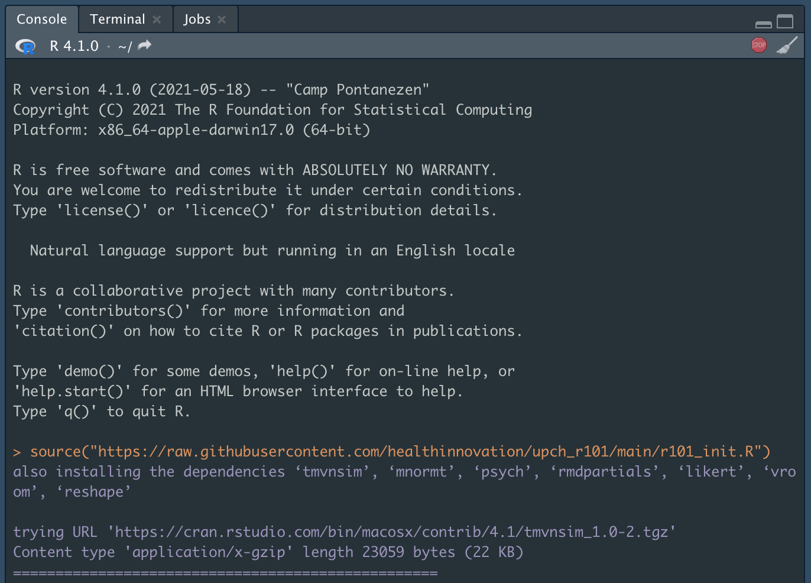
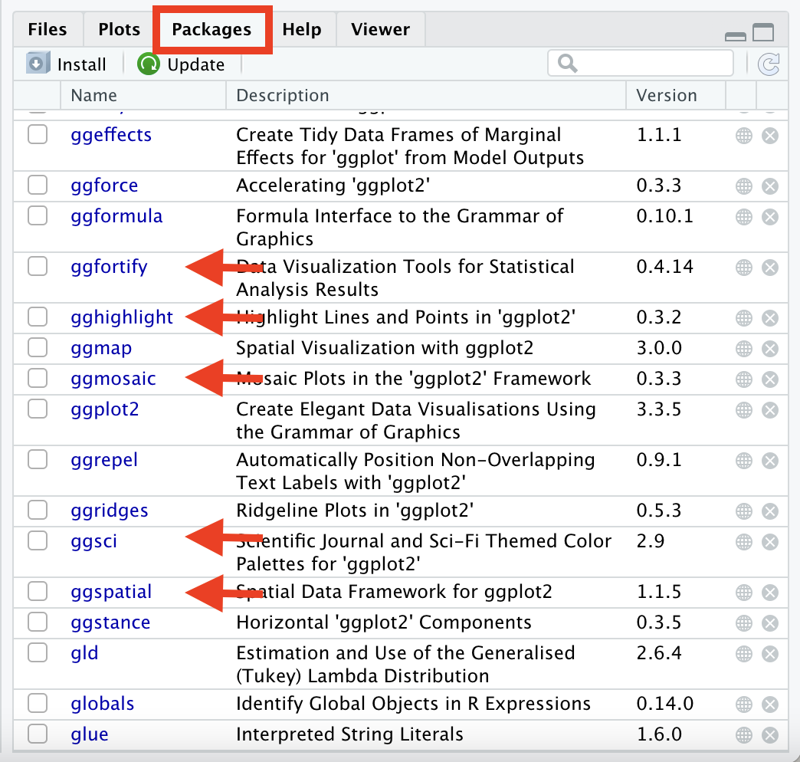
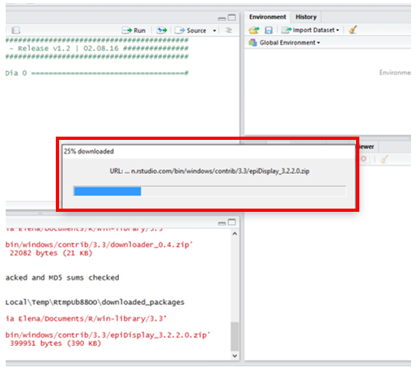

# Pre-requisitos {-}

A continuacion encontrara un paso a paso para:

1. Descargar e Instalar R
2. Descargar e instalar RStudio
3. Descargar e instalar los paquetes que se utilizaran durante el curso

Requiere de una laptop donde instalar los programas y de una conexion a internet estable durante el proceso de descarga e instalacion.

Para el curso deberá tener instalados los siguientes programas:

  * [R](https://cran.r-project.org/)
  * [RStudio](https://rstudio.com/products/rstudio/)
  
Los siguientes detalles son tomados de [Riva Quiroga](https://twitter.com/rivaquiroga)

## 1. Instalar R {-}
Puedes descargar R desde https://cran.r-project.org/. Debes elegir la opción que corresponda, según tu sistema operativo.

<center>

</center>

Si utilizas Windows, te preguntará qué es lo que quieres instalar. Selecciona "base".

<center>

</center>

En el caso de Mac, elige la primera opción que aparece bajo "Latest release", es decir, "R-4.1.2.pkg (notarized and signed)".

Luego, sigue los pasos de instalación, tal como lo haces con cualquier programa.

Si todo sale bien, al abrir R en tu computador deberías ver algo parecido a esto en Windows:

<center>

</center>

Y en Mac se debería ver así:

<center>

</center>

(La información sobre la versión de R y sobre el sistema operativo que aparece en ese mensaje inicial puede que se vea distinto en tu caso.)

## 2. Instalar RStudio{-}

Una vez que R ha quedado correctamente instalado, descarga RStudio desde https://www.rstudio.com/products/rstudio/download/. Elige la primera opción, es decir, "RStudio Desktop Open Source License" (gratuita).
Instala RStudio en tu computador, tal como lo haces con cualquier programa.
Si quedó todo bien instalado, cuando abras RStudio deberías ver algo parecido a esto (algunas cosas pueden variar según tu sistema operativo):

<center>

</center>

A lo largo del curso usaremos una versión reciente de R y RStudio, así que si tienes instalada una versión previa, puede que algunas cosas se vean un poco distintas. Versiones de R anteriores a la 3.5 harán que algunas cosas no funcionen, por lo que te sugerimos actualizar.

> **IMPORTANTE:** Si te encuentras con algún error durante este proceso, lo más probabable es que sea por alguna configuración de tu sistema operativo. En ese caso, la mejor manera de buscar una solución es copiar el error que arroja R, pegarlo en tu motor de búsqueda favorito y ver cómo alguien que se enfrentó a eso antes lo resolvió. Si por alguna razón no logras resolver los problemas de instalación antes de la primera clase, no te preocupes. Durante esa sesión utilizaremos la versión en la nube de RStudio. A continuación explicaremos cómo registrarse.

```{r , echo=FALSE, fig.align="center", out.width = '40%'}
knitr::include_graphics("./_figs/0/ins1.png")
```

Para más detalles sobre la configuración de RStudio ver tutorial de [Shannon Pileggi](https://www.pipinghotdata.com/posts/2020-09-07-introducing-the-rstudio-ide-and-r-markdown/)

> **Importante:** `RStudio` es una interfaz a `R`, es decir, necesita que `R`se encuentre instalado en el equipo para poder usarse. En este curso toda nuestra interacción con `R` sera a través de `RStudio`. No es necesario abrir ambos programas, _**solo abrir `RStudio` y continuar con la instalación**_.

## 3. Instalar Paquetes {-}

Ademas, R y RStudio deberá instalar paquetes con funcionalidades adicionales.

Los `paquetes` necesarios para este curso son:

```{r eval=F, echo=F}
libs = lapply(list.files(pattern = "0.+Rmd"),
              function(x){
                  d = readLines(x)
                  d = d[grepl("library\\(.*\\)", d)]
                  gsub("library\\((.*)\\)", "\\1", d)
              })

x <- unique(unlist(libs))
list_pckg <- x[ !x %in% c("DT","patchwork")]

write.csv(list_pckg, "./_git/list_pckg.csv", row.names = F)

write.csv(list_pckg, "../upch_r101/list_pckg.csv", row.names = F)

```

```{r echo=F, message=F, warning=F, }
options(knitr.kable.NA = '')

library(tidyverse)

x <- read.csv("../list_pckg.csv", stringsAsFactors = F) %>% unlist()
z <- sort(x)

zz <- split(z, 
            cut(seq_along(z), 4,labels = FALSE)) 

z2 <- do.call(qpcR:::cbind.na, zz)

row.names(z2) <- NULL

kableExtra::kable(z2, col.names = NULL,
                  caption = "Tabla 1: Paquetes de R requeridos")

```

### Instalacion automatica {-}

Para instalar todos los paquetes necesarios para el curso, copiar el siguiente código en la consola y dar `ENTER`.

```{r eval=F}
source("https://raw.githubusercontent.com/healthinnovation/upch_r101/main/r101_init.R")
```

```{r , echo=FALSE, out.width = '90%', fig.align="center"}

```

Es posible que se nos muestre el siguiente mensaje al momento de la instalación. Escribir "Yes" en la consola para autorizar la instalación de algunas dependencias.

```{r , echo=FALSE, fig.align="center", out.width = '70%'}
knitr::include_graphics("./_figs/0/ins_w.png")
```

Verificar que los paquetes en la `Tabla 1: Paquetes de R requeridos` se han instalado correctamente en la parte inferior derecha de RStudio, pestaña "Packages".

```{r , echo=FALSE, fig.align="center", out.width = '70%'}

```

### Instalacion manual {-}

De lo contrario se puede realizar la instalación de los `paquetes` de forma manual siguiento estos pasos:

**1. Ingrese al programa RStudio**

Una vez dentro, dirigirse al panel de `packages`

```{r , echo=FALSE, out.width = '100%', fig.align="center"}
knitr::include_graphics("./_figs/0/rstudio3.png")
```

**2. Hacer click en `Install`**

```{r , echo=FALSE, out.width = '70%', fig.align="center"}
knitr::include_graphics("./_figs/0/install.png")
```

**3. Colocar el nombre de los paquetes que se deben instalar**

Instalar todoslos paquetes listados en la `Tabla 1: Paquetes de R requeridos`.

```{r , echo=FALSE, fig.align="center", out.width = '70%'}
if (knitr::is_html_output()) {
    knitr::include_graphics("./_figs/0/rstudio_install_packages.gif")
} else {
    knitr::include_graphics("./_figs/0/rstudio_install_packages.png")
}
```

**4. Descarga e instalación**

La instalacion demora menos de 5 minutos. Es normal que aparezcan algunas ventanas de descarga mientras se instalan los paquetes. **Es indispensable tener conexion a internet**

```{r , echo=FALSE, fig.align="center", out.width = '70%'}

```

**5. Verificación**

Si deseas comprobar que los paquetes se han instalado correctamente, puedes encontrar los paquetes instalados en la parte inferior derecha de RStudio, pestaña "Packages". Verificar que los paquetes en la `Tabla 1: Paquetes de R requeridos` se han instalado correctamente.

```{r , echo=FALSE, fig.align="center", out.width = '70%'}

```

